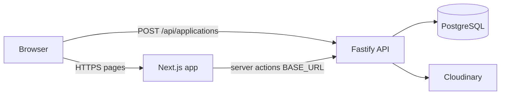

# AfrESH Modeling (Onyxx)

Monorepo with two deployable apps:

| App | Folder | Stack | Role |
|-----|--------|-------|------|
| **Web** | `/` (repo root) | Next.js 15 | Marketing site, apply form UI, admin UI |
| **API** | `/onyxx-backend` | Fastify 5 | Auth, applications, roster, editorial, hire-models, metrics |

Deploy them as **two separate DigitalOcean App Platform apps** so each can scale and restart independently.

---

## Prerequisites

- **Node.js 20+**
- **PostgreSQL** (DigitalOcean Managed Database or Supabase)
- **Cloudinary** account (media uploads)
- **Resend** account (optional; application status emails from the API)
- Two DO App Platform apps (or one app with two components — separate apps is simpler)

---

## 1. Database setup (once)

1. Create a PostgreSQL database.
2. Apply the schema from the API folder:

```bash
psql "$DATABASE_URL" -f onyxx-backend/sql/schema.sql
```

3. Create an admin user (bcrypt hash, cost 10). Example using Node:

```bash
cd onyxx-backend
node -e "import('bcryptjs').then(b=>b.hash('your-password',10).then(console.log))"
```

Insert into `admin_users` (see commented example in `sql/schema.sql`).

---

## 2. Deploy the API (backend) first

Create a **new App** on DigitalOcean → **GitHub** → this repository.

### Component settings

| Setting | Value |
|---------|--------|
| **Source directory** | `onyxx-backend` |
| **Build command** | `npm install && npm run build` |
| **Run command** | `npm start` |
| **HTTP port** | `8080` |
| **Health check path** | `/health` |

Reference spec: `onyxx-backend/.do/app.yaml`

### Environment variables (API app)

| Variable | Required | Notes |
|----------|----------|--------|
| `DATABASE_URL` | Yes | Postgres connection string (`?sslmode=require` on DO) |
| `JWT_SECRET` | Yes | Long random string; **must match** the web app |
| `CORS_ORIGINS` | Yes* | Comma-separated **frontend** URLs (see below) |
| `CLOUDINARY_CLOUD_NAME` | Yes | Same as web app |
| `CLOUDINARY_API_KEY` | Yes | |
| `CLOUDINARY_API_SECRET` | Yes | |
| `CLOUDINARY_UPLOAD_FOLDER` | No | Default `afresh` |
| `PUBLIC_SITE_URL` | Recommended | Your public site URL (emails / logo links) |
| `RESEND_API_KEY` | For emails | |
| `RESEND_FROM` | For emails | e.g. `AfrESH Modeling <afreshmodeling@gmail.com>` |
| `PORT` | Auto | DO sets `8080`; local dev uses `4000` in `.env` |

\* `http://localhost:3000` and `https://afreshmodeling.com` are always allowed. You **must** add your deployed web URL, e.g.  
`CORS_ORIGINS=https://your-web.ondigitalocean.app,https://afreshmodeling.com`

### After deploy

Copy the API’s public URL, e.g. `https://afreshmodeling-logic-xxxxx.ondigitalocean.app`.

Verify:

```bash
curl https://YOUR-API-URL/health
# {"ok":true}
```

---

## 3. Deploy the web (frontend)

Create a **second App** → same repo, **root** directory.

### Component settings

| Setting | Value |
|---------|--------|
| **Source directory** | `/` (leave empty / root) |
| **Build command** | `npm install && npm run build` |
| **Run command** | `npm start` |
| **HTTP port** | `8080` |
| **Health check path** | `/api/health` |

Reference spec: `.do/app.yaml`

### Environment variables (web app)

| Variable | Required | Notes |
|----------|----------|--------|
| `BASE_URL` | Yes | **API URL** from step 2 (no trailing slash) |
| `NEXT_PUBLIC_BASE_URL` | Yes | Same as `BASE_URL` (browser apply form) |
| `JWT_SECRET` | Yes | **Same value** as API `JWT_SECRET` |
| `CLOUDINARY_CLOUD_NAME` | Yes | |
| `CLOUDINARY_API_KEY` | Yes | |
| `CLOUDINARY_API_SECRET` | Yes | |
| `CLOUDINARY_UPLOAD_FOLDER` | No | Default `afresh` |
| `PUBLIC_SITE_URL` | Recommended | This app’s public URL / custom domain |
| `DATABASE_URL` | Optional | Only if using Next-side hire-models DB fallback |
| `NEXT_SERVER_ACTIONS_ENCRYPTION_KEY` | **Yes (prod)** | `openssl rand -base64 32` — same value at **build and run**; fixes admin Server Action 404s |
| `PORT` | Auto | DO sets `8080` |

Example:

```env
BASE_URL=https://afreshmodeling-logic-xxxxx.ondigitalocean.app
NEXT_PUBLIC_BASE_URL=https://afreshmodeling-logic-xxxxx.ondigitalocean.app
JWT_SECRET=<same-as-api>
PUBLIC_SITE_URL=https://your-web.ondigitalocean.app
```

Verify:

```bash
curl https://YOUR-WEB-URL/api/health
# {"ok":true,"status":"healthy"}
```

---

## 4. Wire frontend ↔ API together



Checklist:

1. **API** `CORS_ORIGINS` includes your **web** app URL (and custom domain).
2. **Web** `BASE_URL` and `NEXT_PUBLIC_BASE_URL` point to the **API** URL.
3. **`JWT_SECRET`** is identical on both apps.
4. **`PUBLIC_SITE_URL`** on the API is your marketing site (web URL or custom domain), not the API host.
5. Run `sql/schema.sql` on the database both apps use.

---

## Local development

### Install

```bash
# Web
npm install

# API
cd onyxx-backend && npm install && cd ..
```

### Environment files

```bash
cp .env.example .env
cp onyxx-backend/.env.example onyxx-backend/.env
```

Edit both files: same `JWT_SECRET`, `BASE_URL=http://127.0.0.1:4000`, `NEXT_PUBLIC_BASE_URL=http://127.0.0.1:4000`.

### Run

**Option A — two terminals**

```bash
npm run dev:backend   # API on http://127.0.0.1:4000
npm run dev           # Web on http://localhost:3000
```

**Option B — one command**

```bash
npm run dev:all
```

---

## Project scripts (root)

| Script | Description |
|--------|-------------|
| `npm run dev` | Next.js dev server |
| `npm run dev:backend` | Fastify API (`onyxx-backend`) |
| `npm run dev:all` | Both concurrently |
| `npm run build` | Production Next build |
| `npm run build:backend` | Compile API (`tsc`) |
| `npm start` | Next production server (`0.0.0.0`, `$PORT` or `8080`) |

API production start (`onyxx-backend`): `node dist/index.js` (listens on `$PORT`, default `4000` locally).

---

## API routes (reference)

| Method | Path | Purpose |
|--------|------|---------|
| GET | `/health` | Health check |
| POST | `/api/auth/login` | Admin login |
| POST | `/api/applications` | Public apply form |
| GET | `/api/roster` | Public roster |
| GET | `/api/editorial` | Public editorial |
| GET | `/api/hire-models` | Public hire models |
| GET | `/api/admin/*` | Admin CRUD (Bearer JWT) |

---

## Troubleshooting

### `globals.scss` — Module parse failed

Production installs must include **`sass`** (listed in root `dependencies`). Rebuild after pulling latest `package.json`.

### Apply form fails / CORS error

- Confirm `NEXT_PUBLIC_BASE_URL` is the **API** URL.
- Add your **web** origin to API `CORS_ORIGINS` and redeploy the API.

### Admin login works locally but not in production

- `JWT_SECRET` must match on web and API.
- `BASE_URL` on the web app must reach the API `/api/auth/login`.
- Cookie `secure` flag requires HTTPS in production.

### `POST /admin/login` 404 / `UnrecognizedActionError` (Server Action not found)

The login form uses a **Next.js Server Action**, not a REST route. The browser POSTs to `/admin/login` with an encrypted action id; a **404** means the server build does not recognize that id.

**Fix (required on DigitalOcean):**

1. Generate a key once: `openssl rand -base64 32`
2. Add **`NEXT_SERVER_ACTIONS_ENCRYPTION_KEY`** to the **web** app env vars in the DO dashboard (App-Level, not runtime-only).
3. **Redeploy** so `npm run build` runs with the key set (the key is baked into the build).
4. Hard-refresh the browser (or purge **Cloudflare** cache for `/_next/*` and HTML) so JS matches the new build.

Also check:

- Custom domain (`afreshmodeling.com`) points at the **Next web service**, not a static site or old deployment.
- You are not mixing an old tab (pre-deploy JS) with a new server — close the tab and reopen after deploy.

### Hire models admin errors

- Ensure `hire_models` exists (`sql/schema.sql`).
- Redeploy API with latest code, or set `DATABASE_URL` on the web app for the Next fallback.

---

## Repository layout

```
.
├── app/                 # Next.js App Router
├── components/
├── lib/
├── public/
├── scripts/start.mjs    # next start -H 0.0.0.0 -p $PORT
├── .do/app.yaml         # DO spec — web app
├── onyxx-backend/
│   ├── src/             # Fastify API
│   ├── sql/schema.sql
│   └── .do/app.yaml     # DO spec — API app
└── legacy/              # Static reference (not deployed)
```

---

## Android app install (Play Protect / target SDK)

The site is a **PWA**. On Android, Chrome wraps it in a **WebAPK** when users tap **Install App**. Google Play Protect blocks installs when the APK’s `targetSdkVersion` is more than two API levels below the device (e.g. Android 15 / API 35 warns on apps targeting API 32 or lower).

### What we changed in the web app

- Web manifest now includes **192×192** and **512×512** PNG icons (required for reliable Android installs).
- Manifest `id`, `lang`, and `categories` updated so Chrome can regenerate a current WebAPK after deploy.
- Service worker cache bumped so clients pick up the new manifest and icons.

**After deploying:** ask users who saw the Play Protect dialog to **uninstall the old “AfRESH” shortcut**, update **Chrome**, then install again from `https://afreshmodeling.com`.

### Play Store or sideloaded APK (Bubblewrap TWA)

If you ship an APK/AAB (e.g. from PWABuilder or Play Console), rebuild with **target API 35** using the config in `android/twa-manifest.json`:

1. Install **JDK 17** and Android SDK (or let Bubblewrap install the JDK when prompted).
2. From repo root, initialize once (interactive):

   ```bash
   npx @bubblewrap/cli@latest init --manifest https://afreshmodeling.com/manifest.webmanifest --directory android
   ```

   Or copy settings from `android/twa-manifest.json` when prompted (`com.afreshmodeling.app`, host `afreshmodeling.com`).

3. Build a release bundle:

   ```bash
   npm run android:build
   ```

4. Publish the new AAB/APK to Play Console (or redistribute). Remove old test tracks that still ship a low `targetSdkVersion` APK.

5. Optional — **Digital Asset Links** for verified TWA: set on the web app:

   ```env
   ANDROID_PACKAGE_ID=com.afreshmodeling.app
   ANDROID_SHA256_FINGERPRINTS=<sha256 from keytool -list -v -keystore android.keystore>
   ```

   Redeploy the web app. Verify: `https://afreshmodeling.com/.well-known/assetlinks.json`

---

## Custom domains

1. Attach domain to the **web** app in DigitalOcean.
2. Add `https://yourdomain.com` to API **`CORS_ORIGINS`**.
3. Set **`PUBLIC_SITE_URL`** on the API to `https://yourdomain.com`.
4. Set **`PUBLIC_SITE_URL`** (or rely on `CORS_ORIGINS`) on the web app as needed.

The API can stay on its `*.ondigitalocean.app` URL; only the marketing site needs a custom domain.
